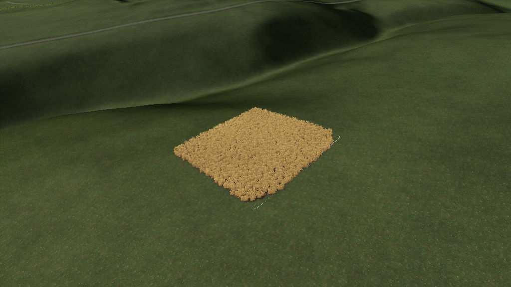
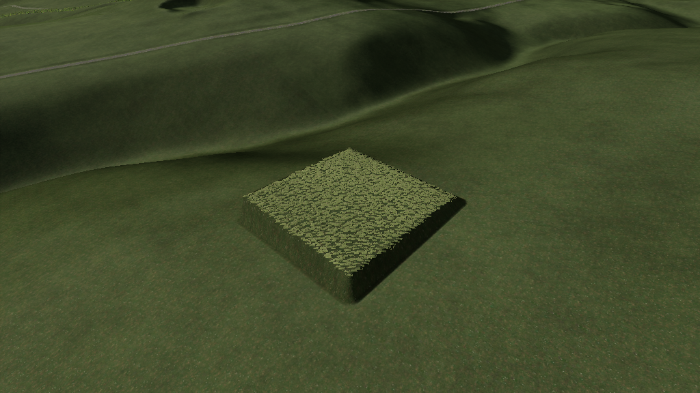
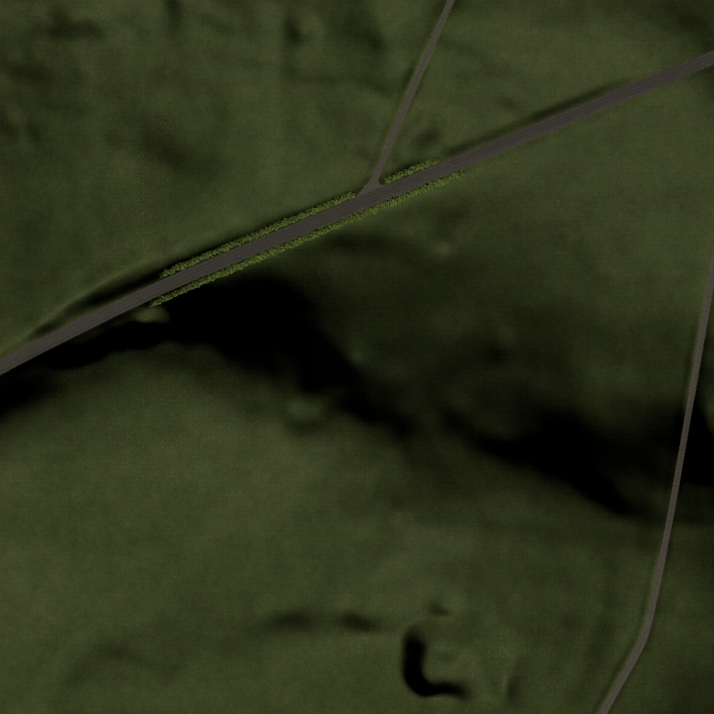
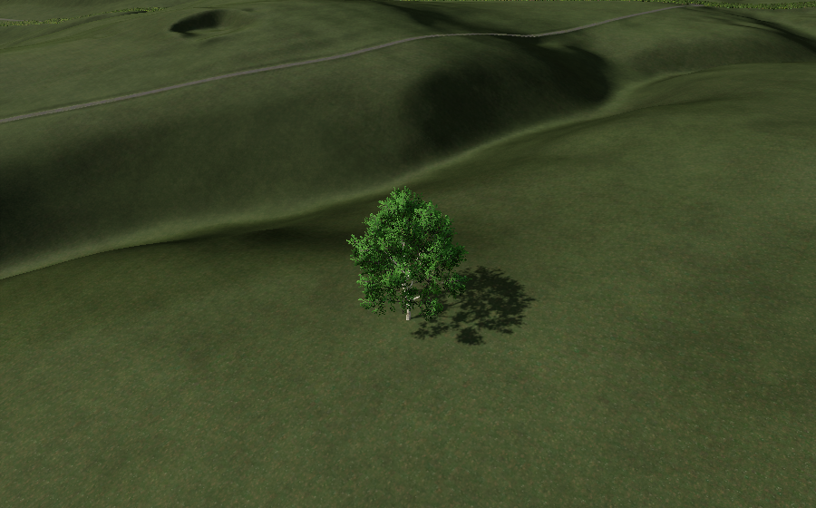

# ge-mcp — GIANTS Editor ⇄ Claude bridge

Let Claude drive a **live GIANTS Editor 10.x (FS25)** session. Ask for a river
and get a carved riverbed along your spline. Ask for a wheat field and get a
game-ready field — polygon, ground, crop, farmland — grown from a closed
spline. Ask "what's broken on my map?" and get audits of file references,
collisions, traffic splines and farmland assignments. Ask "show me" and Claude
*looks at your editor* and answers.

**59 tools** across 12 toggleable groups, plus a **snippet library** that turns
any Lua that worked once into a replayable one-liner.

```
you:    carve a 2m deep creek along creek_spline and paint the bed with mudDark01
claude: spline_adjust_terrain(creek_spline, mode=lower, depth=2, width=6)   [preview → commit]
        spline_adjust_terrain(mode=smooth)                                  [soften banks]
        spline_paint_terrain(creek_spline, layer=mudDark01, width=5)        [bed texture]
        viewport_screenshot()                                               [shows you the result]
```

## Gallery — real output, live editor

| | |
| --- | --- |
|  | **A field in five calls**: closed spline → `field_ops create_from_spline` → `set_ground` → `set_fruit wheat 8` — official field structure, cultivated ground, harvest-ready crop. |
|  | **Area tools**: `terrain_flatten_area` + `paint_foliage_area` fill exactly to the spline boundary (engine-side polygon rasterization). |
|  | **`camera_topdown`**: orthographic minimap tiles on demand, camera restored exactly afterwards. |
|  | **`asset_ops`**: search 5,000+ base-game i3ds, `place` terrain-snapped into the scene in one call. |

## Why it's safe to point at your map

Built after (and because of) real editor crashes and eaten maps:

1. **Every write tool previews by default** — `commit=false` reports op counts
   and what would change; only `commit=true` touches the scene.
2. **Op caps** refuse oversized jobs instead of freezing/crashing GE.
3. **Deterministic seeds** — the preview IS the commit (same seed, same result).
4. **Placements go into one fresh group** — delete it to undo the whole run.
5. **Terrain height ops are two-phase** (all reads before writes) so passes
   never compound; relative lower/raise with identical args invert each other.
6. **Deletion crash-guards** — selection cleared first (deleting a selected
   node crashes GE), root/terrain/camera refused, ids validity-checked.
7. **`run_lua` is validated** against the editor's live globals before it runs;
   unknown names are refused with suggestions instead of exploding mid-script.

Terrain/foliage paints have **no editor undo** — `save_scene` first when unsure.

## The pieces

| Piece | Where | Job |
| --- | --- | --- |
| MCP server | `ge_mcp/` (Python) | tools, validation, safety gates |
| Poller | `lua/ge_mcp_poller.lua` | runs in the editor; executes Lua, captures events |
| Helper library | `lua/ge_mcp_helpers.lua` | auto-injected into the editor on first use |
| Snippets | `snippets/*.json` | your saved, replayable scripts (shareable packs) |

Server and editor talk through XML mailbox files in the editor's AppData folder
(base64 payloads; race-free single-flight). The editor version is auto-detected.

## Quickstart

**Claude Desktop, one click**: `pip install mcp`, then drag `ge-mcp-<version>.mcpb`
into Claude Desktop, ask Claude to *"run setup with install_poller"*, start the
editor and run **Scripts → GE-MCP Bridge**. Done. Manual route:

1. `pip install mcp` (or `pip install -e .` in this folder for the `ge-mcp` command)
2. Register the server — Claude Desktop `claude_desktop_config.json`:
   ```json
   "giants-editor": {
     "command": "python",
     "args": ["D:\\path\\to\\GiantsEditor-mcp\\giants_mcp_server.py"]
   }
   ```
   (Claude Code: `claude mcp add giants-editor -- python D:\path\to\giants_mcp_server.py`)
3. Each editor session: run `lua/ge_mcp_poller.lua` from the editor's **Scripts**
   menu (drop it in `%LOCALAPPDATA%\GIANTS Editor 64bit <version>\scripts\` once).
   The log shows `[GE-MCP] bridge armed` — you're live.
4. Ask Claude to `ping_editor`, then try `list_splines` or `viewport_screenshot`.

Full setup details and troubleshooting: [INSTALL.md](INSTALL.md).
Complete tool reference: [docs/TOOLS.md](docs/TOOLS.md).
How it works inside: [docs/ARCHITECTURE.md](docs/ARCHITECTURE.md).

## What can I ask it?

Plain English — Claude picks the tools. Real examples that work today:

**See and inspect**
- "Take a screenshot of my editor" / "Show me field 12 from above"
- "Orbit around the old barn and show me all four sides"
- "What's selected right now?" / "How many hectares is field 3, and how steep?"
- "Show me the slope heatmap of the viewport" (debug render modes)

**Terrain & water**
- "Carve a 2m deep creek along creekSpline, smooth the banks, and paint the bed with mudDark01"
- "Flatten a building pad inside my pad_outline spline and blend the edges"
- "Paint rock texture on every slope steeper than 25° inside my quarry spline"

**Planting & placing**
- "Place oak trees every 8m along treeline_south with random rotation and scale 0.9–1.2"
- "Build a fence along paddock_spline — posts every 2.5m"
- "Find a birch in the base game and place one at 500, 620"
- "Make my rock pile look natural" (randomize + tilt to slope)

**Fields & gameplay**
- "Turn my closed spline into field 22, cultivate it and plant wheat ready to harvest"
- "Which fields are on the wrong farmland?" / "Paint farmland 14 inside this boundary"

**Map quality (run before releasing)**
- "Back up my map" — always before a painting session
- "Audit my map: broken file references, collisions, traffic splines"
- "List every node with a clip distance over 100000" (via a saved snippet)

**Power user**
- "Search the editor API for anything about splines" / "Read how my fence panel script works"
- "Run some Lua: ..." — validated against the editor's live functions before it executes
- "Save that as a snippet" — anything that worked becomes a replayable one-liner

Every write shows a **preview first** (what, where, how many operations) and
only applies when you confirm. Placements land in one group — delete it to undo.

## Tool groups

- `core` — bridge health, `setup` diagnostics, validated `run_lua`, API search, shipped + user script reading, editor events
- `splines` — discovery, placement along splines, full **edit-point editing** (drape/resample/reverse/split/join/offset copies), connected fence lines
- `terrain` — texture/foliage bands and polygon fills, height shaping (road beds, U/V riverbeds, relative carve/raise/smooth), flatten pads, slope-based auto-texturing, stats
- `nodes` — inspect, transform, rename, safe delete, world-preserving reparent, randomize, terrain/normal alignment, i3d import
- `fields` — create fields from splines, ground/fruit painting, farmland ownership + audit, generic info layers
- `hygiene` — scene/file-reference/texture/collision/light audits, batch rename/clean/array/replace, XPath into the i3d
- `materials` / `traffic` — shader parameter work; traffic-spline validation (convention-aware)
- `assets` — the `$data` catalog: search, inspect, place; modDesc + placeable validation, fruit/fill types
- `vision` — screenshots into chat, camera aiming/orbit/top-down tiles, 39 debug render modes, editor log
- `scene` — verified save (Ctrl+S + ON_SAVE confirmation), timestamped map backups
- `snippets` — save/run/list proven Lua at zero schema cost

Trim what registers with `GE_MCP_GROUPS` (e.g. `core,splines,nodes`) to keep
context small in schema-heavy clients. Full reference: [docs/TOOLS.md](docs/TOOLS.md).

## Snippets: the self-growing toolkit

When Claude writes a `run_lua` that works and is worth keeping, it saves it:

```
save_snippet("find-high-clip", lua, description="list nodes with clipDistance > ARGS.limit",
             params="limit=800")
run_snippet("find-high-clip", "limit=500")
```

Unlimited saved scripts, zero added schema cost, and `snippets/` is plain JSON —
swap packs with other modders.

## Compatibility

GIANTS Editor 10.x / FS25 on Windows. Tested on 10.0.13. Editor updates don't
break the bridge (paths auto-detect); new editor APIs appear via `refresh_api`.

## Something broke?

Ask Claude to run `setup` (it names the broken link) and `read_log 40 errors`,
then send MARVVV both outputs plus your GE version and what you asked for.
Most "nothing works" reports are one of the first three rows of the
[troubleshooting table](INSTALL.md#troubleshooting).

Not affiliated with GIANTS Software. MIT licensed — see [LICENSE](LICENSE).
Inspired by the community's editor panel scripts (spline paint/height/foliage
panels by W_R/Nicolas Wrobel, Farmerboys, FSG, XPModder and others) — this
project wraps the same proven engine calls in a conversational, safety-gated
interface.
